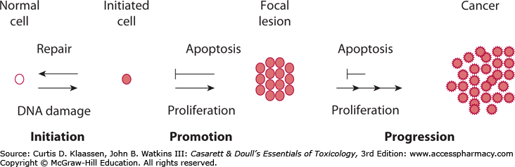
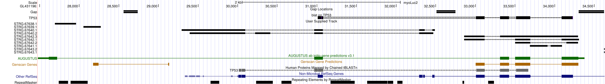
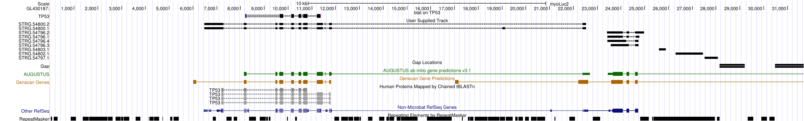

class: center, middle

# Animals Get Cancer when Cells Accumulate the Right Mutations Over Time

```{r setup, include=FALSE}
options(htmltools.dir.version = FALSE)
library(ape)
library(tidyverse)
library(knitr)
options(readr.num_columns = 0)
library(ggtree)
library(gghighlight)
library(ggpubr)
library(ggplotify)
library(UpSetR)
library(wordcloud)
library(cowplot)
library(viridis)
library(RColorBrewer)
library(ggrepel)
library(scales)
```




---
class: center

# Cancer Risk Increases with Size


```{r, echo=F, fig.align="center", message=F, warning=F, error=F, fig.show="hold", fig.width=12}
# Data sets
## SEER
seer <- read_lines(
  "../../data/other/SEER18_IncidenceByAge_Sex_Race.csv",
  skip=3
  ) %>% 
  head(n=-13) %>% 
  paste(collapse = "\n") %>%
  read_csv(
    na = "-",
    col_names = T,
    col_types = list(
      "Sex"=readr::col_factor(
        levels=c("Both Sexes", "Female", "Male")
        ),
      "Race/Ethnicity"=readr::col_factor(
        levels=c('All Races (includes Hispanic)', 'American Indian / Alaska Native (includes Hispanic)', 'Asian / Pacific Islander (includes Hispanic)', 'Black (includes Hispanic)', 'Hispanic (any race)', 'Non-Hispanic White', 'White (includes Hispanic)')
        ),
      "Age" = readr::col_factor(
        levels=c('<1', '1-4', '5-9', '10-14', '15-19', '20-24', '25-29', '30-34', '35-39', '40-44', '45-49', '50-54', '55-59', '60-64', '65-69', '70-74', '75-79', '80-84', '85+'), 
        ordered = T
        )
      )
    ) %>% 
  mutate(`Race/Ethnicity` = str_remove(`Race/Ethnicity`, "\\(includes Hispanic\\)"))

## Nunney 2018
nunney2018 <- read_csv(
  "../../data/other/Nunney2018CancerRiskHeightBMI.csv",
  col_types = list(
    "Cancer Type" = readr::col_factor(
      c('Thyroid', 'Skin - Melanoma', 'NH Lymphoma', 'Colon', 'Urinary Tract – Kidney', 'Ovary', 'Breast', 'Endometrium', 'Biliary tract', 'CNS', 'Rectum', 'Leukemia', 'Lung – never smoker', 'Liver', 'Multiple myeloma', 'Urinary Tract – Bladder', 'Prostate', 'Lung – smoker', 'Pancreas', 'Oesophagus', 'Stomach', 'Mouth/Pharynx', 'Cervix', 'Overall Mean'), 
      ordered = F
    )
  )
  ) 

## Abegglen et al
Abegglen2015 <- read_csv("../../data/other/Abegglenetal2015CancerTable.csv") %>% 
  mutate(
    logMassLifeSpan=log10(`Adultmass(Kg)`)+log10(`Maximumlifespan(yrs)`)
    ) %>% 
  rename(`Common name` = CommonName)

## Anage
anage <- read_tsv(
  "../../data/other/anage_build14.txt", 
  col_names = T, 
  col_types = list("References" = col_character())  # Needs to be specified or else its interpreted as <int>
  ) %>% 
  filter(
    !is.na(`Maximum longevity (yrs)`), 
    !is.na(`Adult weight (g)`)
    )

anage.mammalia <- anage %>% 
  filter(
    Class == 'Mammalia')
```


```{r, echo=F, fig.align="center", message=F, warning=F, error=F, fig.show="hold", fig.width=12}
# Plots
seer.plot <- seer %>%
  filter(
    Sex=="Both Sexes",
    !Age %in% c("<1","5-9") # No data
    ) %>% 
  ggplot(aes(x=as.factor(`Age`), y=`Rate per 100,000`, color=`Race/Ethnicity`)) + 
  geom_point() +
  geom_ribbon(
    aes(
      ymin=`Rate Lower Confidence Interval`, 
      ymax=`Rate Upper Confidence Interval`, 
      ),
    alpha=0.2
  ) + 
  scale_y_log10() + 
  labs(
    y="Incidence Rate per 100,000 (log)",
    x="Age at Diagnosis",
    caption="SEER18 Cancer Statistics Review, 1975-2015, NCI",
    title="Caner rates correlate with age"
    ) + 
  theme_pubclean() + 
  theme(
    axis.text.x = element_text(angle = 45, vjust = .5),
    legend.position = "bottom"
    )
  
```

--

# What happens if we extend this logic across species?  

---
class: center

# Mammals Vary in Size and Lifespan...

```{r anage, echo=F, fig.align="center", message=F, warning=F, error=F, fig.show="hold", fig.width=12}
anage.mammalia.plot <- anage.mammalia %>% 
  ggplot(
    aes(`Adult weight (g)`, `Maximum longevity (yrs)`, color=Order, text=str_glue("Common Name: {`Common name`}<br>Data Quality: {`Data quality`}<br>Sample size: {`Sample size`}"))
  ) +
  geom_point(size=1) +
  scale_x_log10() +
  scale_y_log10() +
  geom_smooth(
    method='lm', 
    aes(`Adult weight (g)`, `Maximum longevity (yrs)`), 
    inherit.aes = FALSE,
    col="black",
    lty="dashed"
    )+
  labs(
    y='Adult Weight - log(g)',
    x='Maximum Longevity - log(yrs) ',
    caption="HAGR AnAge Database, 2017"
  ) +
  theme_pubclean() + 
  theme(legend.position = "None")+
  labs_pubr()

anage.mammalia.plot

```

---
class: center

# ...But Cancer Rates are Similar:  Peto's Paradox  

```{r anage + cancer, message=F, warning=F, error=F, echo=F, fig.align="center", fig.show="hold", fig.width=12}
Abegglen2015.plot <- Abegglen2015 %>% 
  left_join(
    .,
    anage.mammalia,
    by="Common name"
  ) %>% 
  ggplot(
    ., 
    aes(
      x=logMassLifeSpan, 
      y=`%Tumors`,
      weight=`#Necropsies`)
    ) + 
  geom_point()+ 
  geom_errorbar(aes(ymin=`Lowerlimit95%CI`, ymax=`Upperlimit95%CI`), width=.1) +
  labs(
    y="% Necropsies with Tumors",
    x="log(Mass(g)xLifespan(yrs))",
    caption="Abegglenetal et al, 2015"
      ) +
  geom_smooth(method="lm") + 
  theme_pubclean()  + 
  ylim(c(-1,80))+
  geom_text_repel(
    data = dplyr::filter(Abegglen2015, `Common name` %in% c("Tasmanian Devil", "Cheetah", "Prairie Dog", "Marmoset")),
    aes(
      x=logMassLifeSpan, 
      y=`%Tumors`,
      label=`Common name`),
    col="red",
    nudge_y = 1,
    nudge_x = 0.1
    ) +
  geom_point(data = dplyr::filter(Abegglen2015, `Common name` %in% c("Tasmanian Devil", "Cheetah", "Prairie Dog", "Marmoset")),
    aes(
      x=logMassLifeSpan, 
      y=`%Tumors`),
    col="red")

ggarrange(plotlist = list(anage.mammalia.plot, Abegglen2015.plot), nrow=2, ncol=1)
```

---
layout: true
class: split-three center

.row[.content[
# How do we resolve Peto's Paradox?  
]]

.row[.content.vmiddle.center[
# "Nothing makes sense except in the light of evolution."  
Theodosius Dobzhansky
]]

.row[.content[
# But **what mechanisms** do large or long-lived animals use avoid cancer?  
]]

---
class: hide-row2 class: hide-row3

---
count:false
class: hide-row3

---
count:false
class: fade-row1 fade-row2

---
layout: true
class: split-two with-thick-border

.column.bg-main1[.content[
.row[
.font2[Different Sizes, Same Lifespan]
]
.row[.content[.font2[
Elephants:  
- TP53 (Sulak et al 2016)  
- LIF (Vazquez et al 2018)  
- MAD2L1 and others (See my poster!)  
]]]
.row[.content[
.font2[
Bowhead Whales:  
- CDKN2C  
- SIRT7  
]]]
]]
.column.bg-main2[.content[
.row[
# Duplications of Tumor Suppressors Play a Role in Suppressing Cancer Risk
]
.row[
.font2[Same Sizes, Different Lifespans?]
]
]]

---

class: hide-row2-col1 hide-row3-col1 hide-row2-col2

---

class: hide-row3-col1 hide-row2-col2
count: false

---

class: hide-row2-col2
count: false

---

class: fade-row1-col1 fade-row2-col1 fade-row3-col1
count: false

---
layout:false

# Bats Are a Perfect System to Study Size and Lifespan in Peto's Paradox

```{r anage highlight bats, message=F, warning=F, error=F, echo=F, fig.show="hold", fig.align="center", fig.width=12}
anage.chiroptera.plot <- anage.mammalia %>% 
  ggplot(
    aes(`Adult weight (g)`, `Maximum longevity (yrs)`, color=Family)
  ) +
  geom_point(size=0.5) +
  scale_x_log10() +
  scale_y_log10() +
  labs(
    title="Vesper Bats have similar sizes, different lifespans",
    y='Adult Weight - log(g)',
    x='Maximum Longevity - log(yrs) ',
    caption="HAGR AnAge Database, 2017"
  ) + 
  gghighlight(
    max_highlight=2000L,
    Order=="Chiroptera",
    use_direct_label = FALSE,
    use_group_by = F
    ) +
  geom_point(size = 2) +
  geom_smooth(
    data = anage.mammalia,
    method='lm',
    aes(`Adult weight (g)`, `Maximum longevity (yrs)`),
    inherit.aes = FALSE,
    col="black",
    lty="dashed"
    ) +
  theme_pubclean() +
  theme(
    legend.position = "bottom"
  ) +
  labs_pubr()

anage.chiroptera.plot
```

---
class: center

## 15 Bat Genomes with available 

```{r, echo=F, warning=F, message=F,fig.align='center', fig.width=12, warning=F}
# Jones et al Chiroptera
data("chiroptera")

chiroptera$tip.label %<>% gsub("_", " ", .)

bat.groupInfo <- split(chiroptera$tip.label, gsub(" \\w+", "", chiroptera$tip.label))
bat.phylo <- groupOTU(chiroptera, bat.groupInfo)
bat.phylo1 <- ggtree(bat.phylo, aes(color=group), layout='circular') +
  labs(caption="Jones et al, 2002")

anage.chiroptera <- anage %>% 
  filter(Order=="Chiroptera") %>%
  unite(SciName, c("Genus", "Species"), sep=" ", remove=F)

genome.species <- c(
  "Rousettus aegyptiacus",
  "Rhinolophus sinicus",
  "Rhinolophus ferrumequinum",
  "Pteropus vampyrus",
  "Pteronotus parnelli",
  "Pteropus alecto",
  "Myotis davidi",
  "Miniopterus natalensis",
  "Megaderma lyra",
  "Hipposideros armiger",
  "Eptesicus fuscus",
  "Eidolon helvum",
  "Desmodus rotundus",
  "Myotis lucifugus",
  "Myotis brandtii"
  )
bat.cells.species <- c(
  "Myotis lucifugus",
  "Myotis evotis",
  "Myotis thysanodes",
  "Myotis yumanensis",
  "Eptesicus fuscus",
  "Glossophaga sorcina",
  "Glossophaga soricina"
)

bat.phylo <- groupOTU(chiroptera, anage.chiroptera$SciName)

bats.no.info.nodes <- setdiff(chiroptera$tip.label, anage.chiroptera$SciName)
chiroptera.anage <- drop.tip(chiroptera, bats.no.info.nodes)

# Lifespan stuff
bat.size.lifespan <- anage.chiroptera %>%
  select(SciName, Family, Genus, Species, `Maximum longevity (yrs)`, `Adult weight (g)`) %>%
  rename(id=SciName)

# Family naming
family.names <- bat.size.lifespan %>% 
  pull(Family) %>% 
  unique
family.species <- sapply(
  family.names, 
  function(x){
    bat.size.lifespan %>% 
      filter(Family==x) %>% 
      pull(id)
    }
  )
# Manually add a few more:
family.species$Hipposideridae %<>% c(., "Hipposideros armiger")
family.species$Rhinolophidae %<>% c(., "Rhinolophus sinicus")
family.species$Vespertilionidae %<>% c(., "Myotis davidii")
family.species$Miniopteridae %<>% c(., "Miniopterus natalensis")
family.species$Mormoopidae <- "Pteronotus parnellii"

bat.phylo.family <- groupOTU(chiroptera.anage, family.species)

# Tree
tt.genomespc <- read.newick("../../data/chiropteraStressTest.data/other/TimeTree_Genome_Species.nwk")
tt.genomespc$tip.label %<>% gsub("_", " ", .)
bat.phylo.genomes <- groupOTU(tt.genomespc, family.species)
```


```{r, echo=F, warning=F, message=F,fig.align='center', fig.width=12, warning=F}
# Tree Graphing
plot5.phylo <- ggtree(bat.phylo.genomes, aes(color=group), size=2) + 
  geom_tiplab(color="Black", hjust=-0.1)

plot5.phylo.size <- facet_plot(plot5.phylo, panel='Size (g)', data=bat.size.lifespan, geom=geom_segment, aes(x=0, xend=`Adult weight (g)`, y=y, yend=y, color=Family), size=5) 
plot5.phylo.lifespan <- facet_plot(plot5.phylo.size, panel='Lifespan (yrs)', data=bat.size.lifespan, geom=geom_segment, aes(x=0, xend=`Maximum longevity (yrs)`, y=y, yend=y, color=Family), size=5) 

plot5.phylo.lifespan + 
  theme_tree2()+
  xlim_expand(100, "Tree")  + 
  theme(
    legend.position = "bottom",
    strip.text = element_text(size = rel(1.5)),
    legend.title = element_text(size = rel(1.5)), 
    legend.text = element_text(size = rel(1))
    ) +
  guides(color=guide_legend(title="Family"))
```

---

# The Little Brown Bat *Myotis lucifugus* has a unique, full-length TP53 Duplicate

```{r Bat Phylo With TP53 and Lifespan, echo=F, fig.align="center", message=F, warning=F, error=F, fig.width=12}
# TP53 Counts
tp53<-tibble(species=genome.species,
             TP53=c(1,1,1,1,1,1,3,2,2,1,2,1,1,7,5),
             TP53_full=c(1,1,1,1,1,1,1,1,1,1,1,1,1,2,1),
             TP53_retro=c(0,0,0,0,0,0,2,1,1,0,1,0,0,5,4))

tp53.1 <- facet_plot(plot5.phylo.lifespan, panel='TP53, Retrogenes', data=tp53, geom=geom_point, aes(x=TP53_retro), color="Blue", size=3) 
tp53.2 <- facet_plot(tp53.1, panel='TP53, Full Loci', data=tp53, geom=geom_point, aes(x=TP53_full), color="firebrick", size=3) 
fig5 <- tp53.2  + 
    theme(
      legend.position = "bottom",
      strip.text = element_text(size = rel(1.5)),
      legend.title = element_text(size = rel(1.5)), 
      legend.text = element_text(size = rel(1))
          ) + 
    scale_color_discrete(name="Family") + 
    xlim_expand(c(0,300), "Tree")
  

fig5
```

---
class: center, middle
# Both TP53 loci show expression in RNA-Seq Datasets

```{r, echo=F, fig.align="center", message=F, warning=F, error=F, fig.width=12}

```



<br>


---
# Additionally, Both Loci Are Expressed in our MyoLuc Cell Lines

[ Eric qPCR data ]

---
class: center
# The little brown bat is more succeptible to DNA Damage than other bat species

```{r Bats Data Load, echo=F, fig.align="center", message=F, warning=F, error=F}
bats.paraquat <- read_tsv("../../data/chiropteraStressTest.output/paraquat/myoLuc0_myoYum1_myoEvo1_myoThy1_eptFus3.paraquat.tsv")
bats.dox <- read_tsv("../../data/chiropteraStressTest.output/doxorubicin/bats.dox.tsv")
myoLuc.dox <- read_tsv("../../data/chiropteraStressTest.output/doxorubicin/myoLuc0,1,2,3,9,10.dox.tsv")
```

```{r, echo=F, warning=F, message=F,fig.align='center', fig.width=12, warning=F}
plot.paraquat <- bats.paraquat %>% 
  filter(Time == 48) %>% 
  ggplot(
  aes(x=as.factor(Treatment), 
      y=Value.Norm,
      color=cell_line,
      fill=cell_line,
      group=cell_line)
  ) + 
  labs(
    x= "Paraquat, 48h (uM)",
    y= "RLU/RFU (log10)",
    color="Cell Line"
    ) + 
  geom_hline(
    yintercept = 1, 
    col="black",
    lty="dashed"
    ) +
  guides(fill=FALSE) + 
  stat_summary(fun.y = "mean", geom="line") +
  stat_summary(fun.data="mean_se", size=0.3, geom="ribbon", alpha=0.2)+
  scale_y_log10(limits=c(0.1,3.5)) +
  annotate("rect", 
           xmin=4.5, xmax=5.5,ymin=0.1,ymax=3.5,
           alpha=0.2,
           ) + 
  facet_grid(vars(Test)) + 
  theme_pubclean() +
  theme(
    #title = element_text(size=rel(1.5)),
    axis.title = element_text(size=rel(1.5)),
    axis.text.x = element_text(
      #angle = 45,
      #hjust = 1,
      size=rel(1)
      ),
    strip.text = element_text(size = rel(1.5)),
    legend.title = element_text(size=rel(1.5)),
    legend.text = element_text(size=rel(1))
    )
plot.dox <- bats.dox %>% 
  filter(Time == 24, Treatment != "NA") %>% 
  ggplot(
  aes(x=as.factor(Treatment), 
      y=Value.Norm,
      color=cell_line,
      fill=cell_line,
      group=cell_line)
  ) + 
  labs(
    x= "Doxorubicin, 24h (uM)",
    y= "RLU/RFU (log10)",
    color="Cell Line"
    ) + 
  geom_hline(
    yintercept = 1, 
    col="black",
    lty="dashed"
    ) +
  guides(fill=FALSE) + 
  stat_summary(fun.y = "mean", geom="line") +
  stat_summary(fun.data="mean_se", size=0.3, geom="ribbon", alpha=0.2)+
  scale_y_log10(limits=c(0.01,10)) +
  annotate("rect", 
           xmin=4.5, xmax=5.5,ymin=0.1,ymax=3.5,
           alpha=0.2,
           ) + 
  facet_grid(vars(Test)) + 
  theme_pubclean() +
  theme(
    #title = element_text(size=rel(1.5)),
    axis.title = element_text(size=rel(1.5)),
    axis.text.x = element_text(
      #angle = 45,
      #hjust = 1,
      size=rel(1)
      ),
    strip.text = element_text(size = rel(1.5)),
    legend.title = element_text(size=rel(1.5)),
    legend.text = element_text(size=rel(1))
    )
ggarrange(plot.paraquat, plot.dox, ncol=1, nrow = 2, common.legend = T, legend = "bottom")
```

---
# Conclusions

.font2[

- The little brown bat *Myotis lucifugus* has two full-length copies of TP53  
- The two loci originate from a whole-locus duplication event  
- Both loci are expressed in public RNA-seq datasets and in our cell lines
- *M. lucifugus* shows an increase in sensitivity to oxidative stress and DNA double-strand breaks compared to other species of bats

]

---
# Future Directions

.font2[

- Using copy-specific siRNAs, knock down each copy of TP53 and reassess DNA damage sensistivity
- Are the duplicates syntenic? Sequence gap across scaffolds
- Study promoter response using Luciferase Assays

]

---
# Acknowledgements

